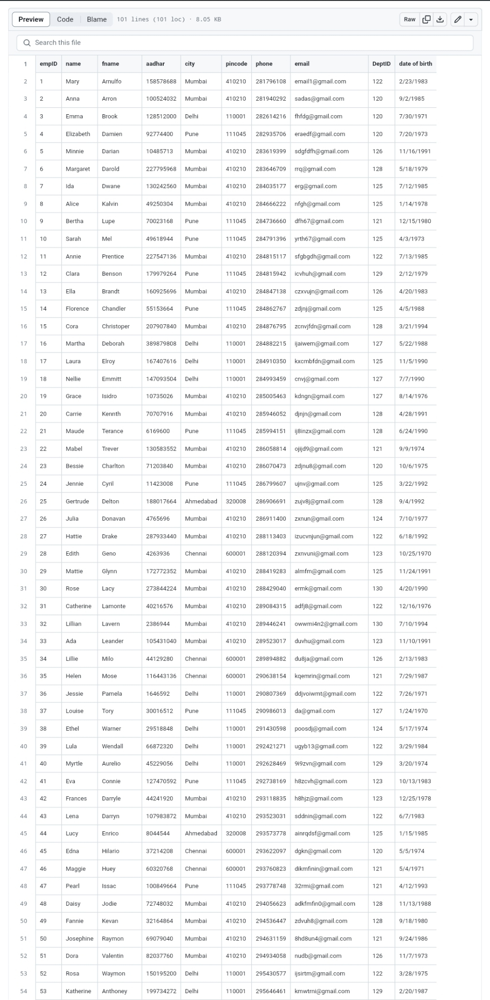
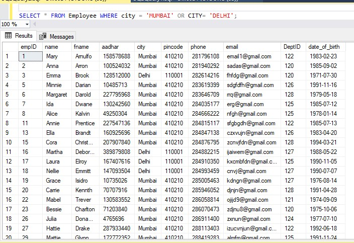
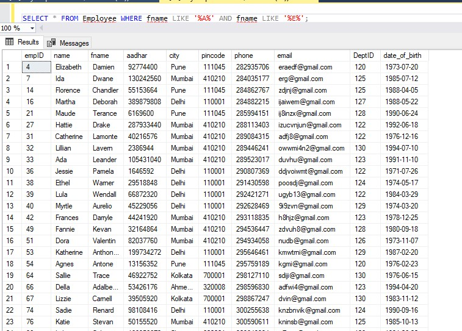
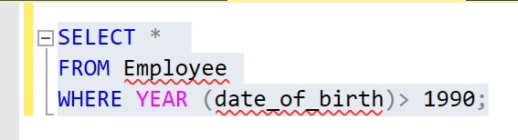

# SQL_Task_2
## Importing datasets and manipulating 

- Imported table Employee

## Query 1: From Table employee show data where city is 'Mumbai' and 'Delhi'

## Query 2: From Table employee show Names that contains'a' and 'e'.

## Query 3: Subset Table employee show Employees whose age is above 1990.

